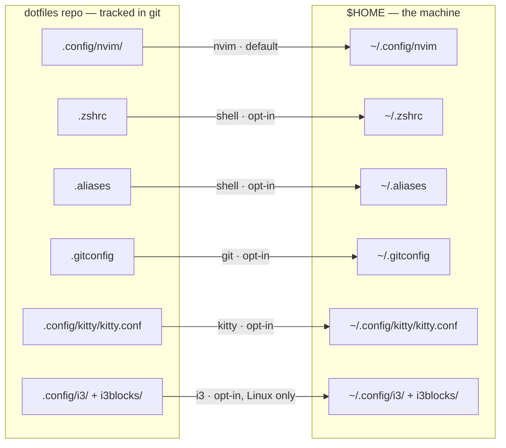
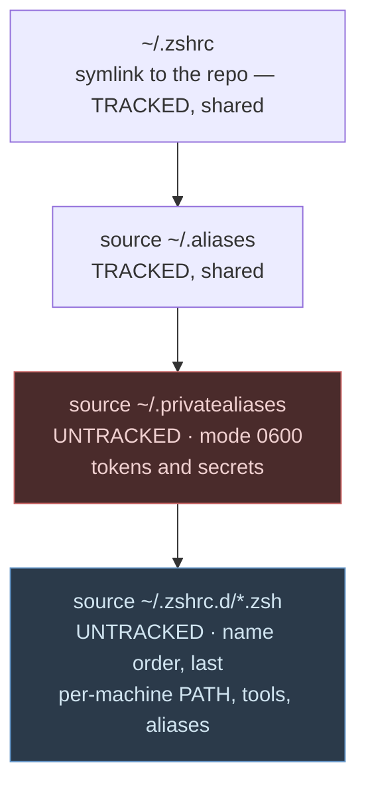
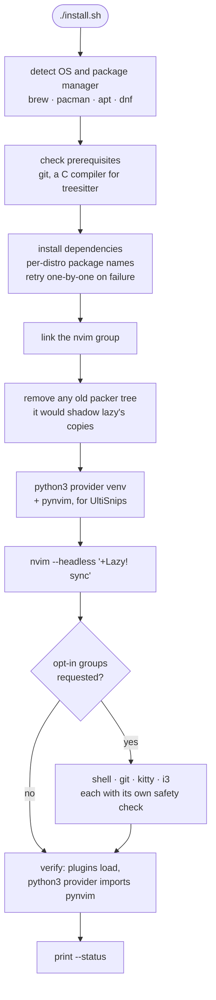
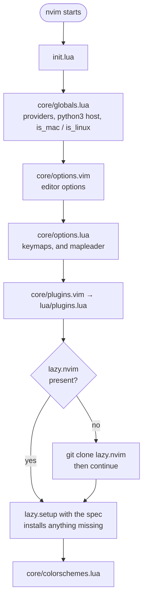
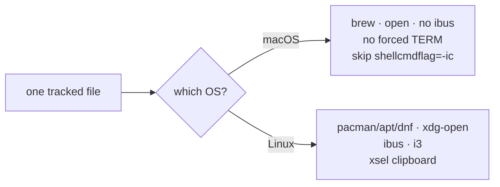

# Architecture

How this repo relates to the machine it is checked out on.

The short version: **the repo is the source of truth, and it is applied as
symlinks.** A managed path is not a copy of the repo — it *is* the repo file
under a second name. There is no sync step and nothing can drift.

## 1. Repo to `$HOME`

`install.sh` reads one manifest and creates symlinks. Only the `nvim` group is
applied by default; the rest is opt-in, because those paths either replace
machine-specific files or are platform-specific.



Because these are symlinks, editing either side is the same write:

```
$ ls -i .config/nvim/init.lua           87297180
$ ls -i ~/.config/nvim/init.lua         87297180   ← same inode, one file
```

Run `./install.sh --status` to see which groups are linked on this machine and
which are still a local copy.

### Adding a managed file

One line in the `manifest()` function in `install.sh`:

```
group|path-in-repo|path-in-HOME
```

then `./install.sh --link-<group>`. Nothing else knows about the list, so there
is no second place to update.

## 2. Shell config: three layers

`.zshrc` is the one file that mixes content which *must* be shared with content
that must *never* be. Splitting it by destination is what makes the shared part
safe to symlink out of a public repo.



| Layer | Tracked | Holds |
| --- | --- | --- |
| repo `.zshrc`, `.aliases` | yes | everything genuinely shared between machines |
| `~/.privatealiases` | **no** | tokens and secrets, mode 0600 |
| `~/.zshrc.d/*.zsh` | **no** | per-machine PATH, tool setup, local aliases |

`~/.zshrc.d` is the part that scales: machine-local config is a **new file**, not
an edit to a shared one. Nothing to merge across machines, nothing to
accidentally commit. Numeric prefixes control order.

Secrets deliberately stay in the single `~/.privatealiases` rather than becoming
another drop-in. One well-known path is easier to hold at 0600, exclude from
backups and audit than one file among many in a directory that gets added to
routinely. `--status` reports the mode of both and warns on anything readable by
other users.

## 3. What `install.sh` does

Everything a config file cannot do for itself: install packages, create the
symlinks, and prepare the Neovim python provider.



Properties worth knowing:

- **Re-runnable.** Anything it would replace is moved to `<path>.backup.<n>`,
  never deleted.
- **`--dry-run`** prints every action without performing any.
- **Refuses unsafe links.** `--link-shell` aborts if `~/.zshrc` still contains
  anything token-shaped, because this repo is public and tracks `.zshrc`.
- **bash 3.2 compatible**, which is what macOS ships. No associative arrays, no
  `mapfile`, no `${var,,}`.

## 4. Neovim

Plugins are managed by [lazy.nvim](https://github.com/folke/lazy.nvim). This is
the plugin manager, **not** LazyVim the distribution — the config is entirely
hand-written, and adopting a distro would replace all of it.

`lazy-lock.json` is tracked on purpose, so a second machine installs the same
plugin revisions rather than whatever is current.



Two ordering constraints that are easy to break:

- **`mapleader` must be set before `lazy.setup`**, or `keys =` specs in the
  plugin table bind to the wrong leader. That is why `options.lua` is sourced
  before `plugins.vim`.
- **Nothing is on the runtimepath until `lazy.setup` has run.** A top-level
  `require` of a plugin module in `options.lua` therefore fails. Plugin modules
  are required *inside* keymap callbacks instead, which also lets lazy defer
  loading the plugin until first use.

Eager versus lazy is a real decision per plugin, not a default:

| Plugin | Load | Why |
| --- | --- | --- |
| `nvim-tree` | eager | its config registers the `VimEnter` autocmd that opens the tree when nvim starts on a directory |
| `telescope` | on demand | required from inside the keymap callbacks |
| `nvim-cmp` | `InsertEnter` | not needed until you type |
| `nvim-lspconfig` | `BufReadPre` | not needed until a file is open |
| `rustaceanvim` | `ft = rust` | irrelevant otherwise |

The python3 provider is pinned to `stdpath("data")/venv`. Left unpinned it
follows whichever `python3` is first on `$PATH`, so activating a conda env
without `pynvim` in it silently breaks UltiSnips.

## 5. One repo, two operating systems

Every machine shares every tracked file. Differences between operating systems are
handled with **conditionals, never forks** — there is no `macos` branch and no
duplicated config, so a change made on any machine is a change for all of them.



The mechanisms:

- **Lua:** `vim.g.is_mac` / `vim.g.is_linux`, set in `core/globals.lua`.
- **zsh:** `[[ "$OSTYPE" == darwin* ]]`, plus `command -v` guards so a missing
  tool degrades instead of erroring.
- **Paths:** probed, never hardcoded. conda, `GOROOT` and Homebrew are all
  discovered rather than assumed.
- **Packages:** `install.sh` maps generic names per manager — `fd` is `fd-find`
  on apt and dnf, `delta` is `git-delta` everywhere, apt needs `python3-venv`
  separately.

## 6. Leaving things unmanaged is a valid choice

Not every group is worth linking on every machine. `--status` calls an unlinked
path "own copy", and that is a fine place to leave it. Common reasons:

| Path | Reason to think twice |
| --- | --- |
| `~/.zshrc` | if yours holds machine-specific setup, split that into `~/.zshrc.d/` first, or you will lose it |
| `~/.gitconfig` | sets `delta` as the pager and `filter.lfs.required`, so it needs `delta` and `git-lfs` installed; it also sets a `user.name` that is probably not yours |
| `~/.config/kitty/kitty.conf` | binds `alt+N` for tabs, which is a poor fit on macOS where alt is a compose key; it also includes a `theme.conf` that is not tracked |
| `.config/vscode/editor.json` | not a path VS Code reads; a reference copy only |
| `.config/i3`, `i3blocks` | X11, so inert on macOS |

If you fork this repo, expect to change `.gitconfig` and the kitty bindings to
your own preferences before linking them.

## 7. The trade-off

Live means live. A `git checkout` or `git pull` in this repo changes the running
editor **immediately** — there is no staging step, and a commit that breaks
`init.lua` breaks nvim until it is fixed. That is the cost of having no drift,
and the reason to keep the working tree on `main` rather than parked on a feature
branch.

One visible consequence: `lazy-lock.json` lives in the repo, so updating plugins
with `:Lazy` leaves the repo dirty. That is intended — commit it, and your other
machines get the same revisions.

## See also

- [`MAC.md`](MAC.md) — macOS specifics and what is not linked there
- [`ISSUES.md`](ISSUES.md) — defects found in this config and how each was fixed
- [`.config/nvim/README.md`](.config/nvim/README.md) — Neovim setup notes
