# Issues found and fixed

Concrete defects that were in this config, why each happened, and how the fix was
verified. Found while porting it from Arch Linux to macOS in July 2026 on Neovim
0.12.4 — though most were not macOS-specific at all.

Two reasons this is worth reading:

- **If you are using this config**, it explains fixes that look arbitrary from the
  diff alone: why `shellcmdflag` is conditional, why plugin modules are required
  inside keymap callbacks, why the python3 provider is pinned to a venv.
- **If you maintain your own Neovim config**, several of these are general traps
  rather than anything specific to this repo — the bootstrap ordering problem in
  section A and the Neovim 0.12 removals in section B will bite any config of a
  similar vintage.

---

## A. Bootstrap — the config could not set up a new machine

Three separate defects, all invisible on a machine that already had plugins
installed, and all fatal on a fresh one.

### A1. `init.lua` aborted before the plugin manager could bootstrap

`init.lua` called `require("ibl").setup()` — indent-blankline, a *plugin* —
before sourcing `plugins.vim`, which is what installs plugins. On a machine with
no plugins the require raised, `init.lua` stopped there, and the plugin manager
was never reached. The next launch failed identically.

```mermaid
flowchart TD
  subgraph before["before — deadlock"]
    B1([nvim starts]) --> B2["init.lua"]
    B2 --> B3["require ibl"]
    B3 --> B4["ERROR: module not found"]
    B4 --> B5["init.lua aborts"]
    B5 --> B6["plugins.vim never sourced<br/>→ no plugin manager<br/>→ no plugins, ever"]
    style B4 fill:#4a2b2b,stroke:#c86464,color:#f0d0d0
    style B6 fill:#4a2b2b,stroke:#c86464,color:#f0d0d0
  end

  subgraph after["after"]
    A1([nvim starts]) --> A2["init.lua"]
    A2 --> A3["source core files<br/>incl. plugins.vim"]
    A3 --> A4["lazy.nvim bootstraps<br/>and installs everything"]
    A4 --> A5["ibl configured by its own spec"]
    style A4 fill:#2b4a32,stroke:#64c878,color:#d0f0d8
  end
```



`core/options.lua` had the same shape: a top-level
`require('telescope.builtin')`.

**Verified** by running the pre-fix revision under an isolated `NVIM_APPNAME`: it
dies at `init.lua:23` and never clones the plugin manager. Confirmed 0 plugins
installed.

**Fixed** by configuring indent-blankline through its plugin spec instead, and by
requiring plugin modules inside keymap callbacks rather than at file scope. The
latter is also what lets lazy.nvim defer loading.

### A2. `fresh_install` was computed and never used

`packer_ensure_install()` returned a flag saying "this is a first run", assigned
it to `local fresh_install`, and nothing ever read it. So even once packer had
been cloned, the first launch installed **no plugins** — you had to know to run
`:PackerSync` by hand.

Wiring the flag up to `packer.sync()` then exposed a second problem: the
config's own sync raced `install.sh`'s `:PackerSync`, and neither completed.

**Fixed** by migrating to lazy.nvim, which installs missing plugins during
`setup()` with no separate step and no race.

**Verified** on an isolated `HOME`: a single `nvim` launch installs all 25
plugins. The same test under packer produced 0.

### A3. `PackerSync` deleted packer itself

packer was not listed in its own plugin spec, so `PackerClean` — which
`PackerSync` runs — treated it as an unmanaged plugin and removed it. Every
following startup re-cloned it.

**Fixed** by the lazy.nvim migration; lazy manages itself.

---

## B. Neovim 0.12 removed APIs this config used

Deprecated for several releases, but removed by the time this was run, so each
one was a hard error or a traceback on every startup.

| API | Status | Replacement |
| --- | --- | --- |
| `vim.pretty_print` | **gone** in 0.12 | `vim.print` |
| `vim.diagnostic.goto_prev` / `goto_next` | **gone** in 0.12 | `vim.diagnostic.jump { count = ±1 }` |
| `lspconfig.<server>.setup` framework | deprecated, prints a traceback | `vim.lsp.config` + `vim.lsp.enable` |
| `vim.lsp.with` | deprecated | pass opts to `vim.lsp.buf.hover` |
| `lspconfig.tsserver` | renamed | `lspconfig.ts_ls` |
| `float.source = "always"` | string form dropped | `source = true` |

Confirmed empirically rather than from release notes:
`vim.pretty_print ~= nil` is `false` on 0.12.4 while `vim.print` exists.

All of it is **version-gated**, not replaced outright, so an older Neovim still
takes the old path:

```lua
local use_native_lsp = vim.lsp.config ~= nil and vim.lsp.enable ~= nil
```

The lspconfig migration also changed how `custom_attach` runs: the builtin API
has no `on_attach`, so it is now driven by an `LspAttach` autocmd.

---

## C. Portability — Arch assumptions that break on macOS

| Assumption | Effect on macOS | Fix |
| --- | --- | --- |
| `xdg-open` for the search-under-cursor map | command not found | `open` when `vim.g.is_mac` |
| `shellcmdflag = '-ic'` | every `:!` re-runs the whole zsh profile — brew, conda, nvm, starship, zinit | skipped on macOS; it exists for vim-forgit, which is commented out |
| `ibus-daemon -drx` | errors on every shell start; ibus is X11 | Linux-only branch |
| `export TERM=rxvt` | wrong terminfo in Terminal.app, iTerm2, kitty; follows you over ssh and tmux | only when the terminal did not identify itself *and* the terminfo entry exists |
| conda hardcoded to Linux prefixes | neither path exists; macOS puts users under `/Users` | probe a list of candidate prefixes |
| `GOROOT=/usr/lib/go` | Homebrew uses its own prefix | `go env GOROOT` when `go` is present |
| no `/opt/homebrew/bin` on `PATH` | every brew-installed tool missing | `brew shellenv` first, on darwin |
| `alias pbcopy='xsel …'` | **shadows the real `pbcopy`**, and `xsel` is X11-only, so every clipboard pipe breaks silently | only alias when `xsel` actually exists |
| `tr -dc` over `/dev/urandom` | BSD `tr` aborts with "Illegal byte sequence" | `LC_ALL=C tr` |
| `/home/$USER` in `rls` | macOS users live under `/Users` | `$HOME` |

`clipboard=unnamedplus` needed no change — Neovim finds `pbcopy` on its own.

---

## D. Correctness

### D1. Trailing-whitespace autocmd failed on read-only buffers

```lua
vim.api.nvim_create_autocmd({ "BufWritePre" }, {
  pattern = { "*" },
  command = [[%s/\s\+$//e]],
})
```

Any write to a non-modifiable buffer raised
`E21: Cannot make changes, 'modifiable' is off`. Hit for real by writing
`:checkhealth` output to a file.

The substitution also clobbered the search register and cursor position on every
save.

**Fixed** with a callback that returns early on `nomodifiable`/`readonly`, uses
`keeppatterns`, and restores the view with `winsaveview`/`winrestview`.
**Verified** both ways: writing `:checkhealth` output now succeeds, and a file
with trailing whitespace still shrinks 16 → 12 bytes on save.

### D2. UltiSnips broke depending on `$PATH`

`vim.g.python3_host_prog = fn.exepath("python3")` resolves to whatever comes
first on `$PATH`. If that happens to be a conda base env or a virtualenv without
`pynvim` installed, UltiSnips fails at startup with "Failed to load python3
host" — and it breaks again every time you activate a different env.

**Fixed** by pinning the provider to `stdpath("data")/venv`, falling back to the
old behaviour when that venv is absent so nothing regresses on a machine that
never created one.

Homebrew's python 3.14 could not create the venv — `ensurepip` fails — so
`install.sh` tries several interpreters rather than assuming `python3` works.

---

## E. Secrets in a tracked shell rc

This repo tracks `.zshrc`, and shell rc files are where API tokens tend to
accumulate as inline `export` lines. That combination is a problem worth
designing against rather than remembering to avoid.

Two things are easy to get wrong, and the first is the one people miss:

1. **File mode.** A shell rc is created `0644` by default — readable by every
   account and every process on the machine. A credential in it is exposed
   locally whether or not the repo is public, and that exposure has nothing to do
   with git.
2. **Reach.** A token typed on a command line also lands in `~/.zsh_history`, and
   any backup of the rc file carries a copy too. Moving the original does not
   retract those.

**How the repo handles it now:**

- Secrets live in `~/.privatealiases` at mode 0600, which the tracked `.zshrc`
  sources and git never sees.
- Machine-local non-secret config lives in `~/.zshrc.d/*.zsh`, so there is no
  reason to edit the tracked file at all.
- `install.sh --link-shell` **refuses to link** while `~/.zshrc` still contains
  anything token-shaped, so you cannot publish a credential by running the
  installer.
- `install.sh --status` reports the mode of `~/.privatealiases` and warns about
  any drop-in readable by other users.

A 0600 file is a floor, not a goal: the values are still plaintext at rest and
still in the environment of every child process. Stronger options are in
[`MAC.md`](MAC.md) — `direnv` for project-scoped tokens, or the OS keystore
(`security` on macOS, `secret-tool`/`pass` on Linux).

**If you inherit an rc with tokens in it,** grep the repo's full history before
assuming they leaked — checking each value against every commit on every ref is
quick and usually reassuring, since a tracked `.zshrc` in the repo is a different
file from the `~/.zshrc` on the machine. Anything that *has* sat in a
world-readable file, in shell history, or in a backup should be rotated. Moving a
credential does not un-expose it.

---

## F. Known rough edges, left alone on purpose

Not bugs — cases where a machine's existing file is often the better one, so these
groups stay opt-in. See [`MAC.md`](MAC.md).

- **`kitty.conf`**: binds `alt+N` for tabs, but alt is a compose key on macOS,
  where `cmd+N` is the native idiom. It also `include`s a `theme.conf` that is
  gitignored and absent, so kitty warns at startup, and hardcodes `/usr/bin/fzf`
  where Homebrew installs to `/opt/homebrew/bin/fzf`.
- **`.gitconfig`**: sets `core.pager = delta` and `filter.lfs.required = true`.
  Without `git-lfs` installed, LFS repos fail to check out.
- **`.config/vscode/editor.json`**: not a path VS Code reads. Real location is
  `~/Library/Application Support/Code/User/settings.json`.
